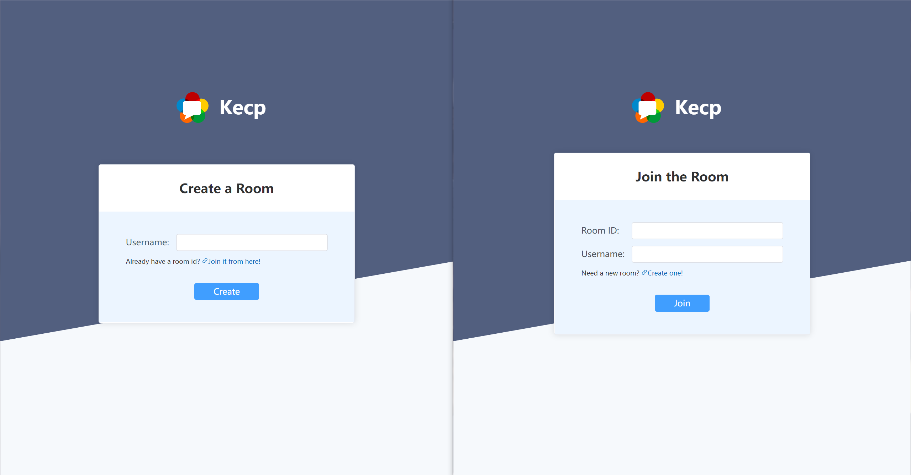
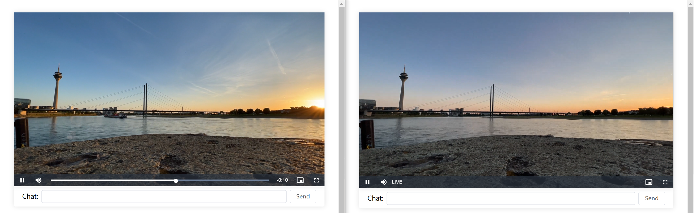

# Kecp: Watch Video Together

## Introduction

Kecp is a webrtc video streaming tool for allowing peers to watch the same video simultaneously. Moreover, a small chatroom is also supported! For now, Kecp is still under construction. API may experience breaking changes.

## Features

- Webrtc: Peer-to-peer connection between two user agents, the data never passes through the web or application server.
- Privacy: The signaling server is open source, you can deploy it on your own server to prevent MITM attacks.
- Secure: It allows you to negotiate a session and then exchange data securely between two peers.
- Cost-effective: No massive data costs on the server. The server is high performance and even a 1vCPU can handle it (but not recommended).
- Local file supported: If you wish to watch videos together on online video platforms, please wait for the extension.

### Screenshots




## Get started

If you are not a developer who intends to use this tool as a library, this tool is generally available for you to use.

### Config

Create a config called `config.toml` at the project's root folder.

Non-production example:

```toml
[server]
debug = true
tls = false
host = "127.0.0.1:8090"
allowed_origins = [""]
```

Production example:

```toml
[server]
debug = false
tls = true
host = "example.com"
allowed_origins = [""]
```

### Build

```shell
make build
```

### Run

```shell
make run
```

## License

Licensed under the Apache License, Version 2.0
